

  

<h1 align="center">Pinova — Epin Scripti & Epin Yazılımı</h1>

<b>Tam otomatik epin satış sistemi · e‑pin / dijital ürün satış sitesi scripti (PHP)</b>

  Pinova'yı; oyun epini, oyun kodu, hediye kartı ve dijital ürünlerin <b>anında otomatik teslimatla</b> satıldığı,
  bakiye + bayilik sistemli, hazır bir <b>epin satış scripti</b> olarak geliştirdim. 
  Steam key, PUBG UC, Valorant VP, Minecraft, PlayStation ve daha fazlası için tek panelden yönetilen <b>epin yazılımı</b>.

  
  
  
  

> Bu bir **tanıtım vitrinidir**. Kaynak kod özeldir; bu depo yalnızca ekran görüntülerini ve öne çıkan özellikleri sergiler.

---

## 📸 Ekran Görüntüleri

| Ana Sayfa | Kategori |
|---|---|
| 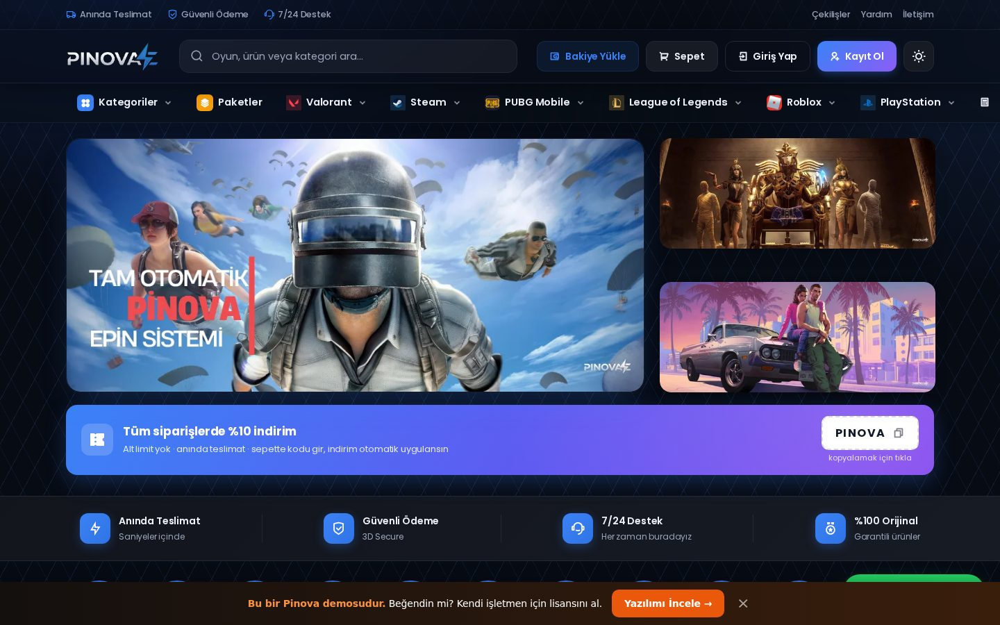 | 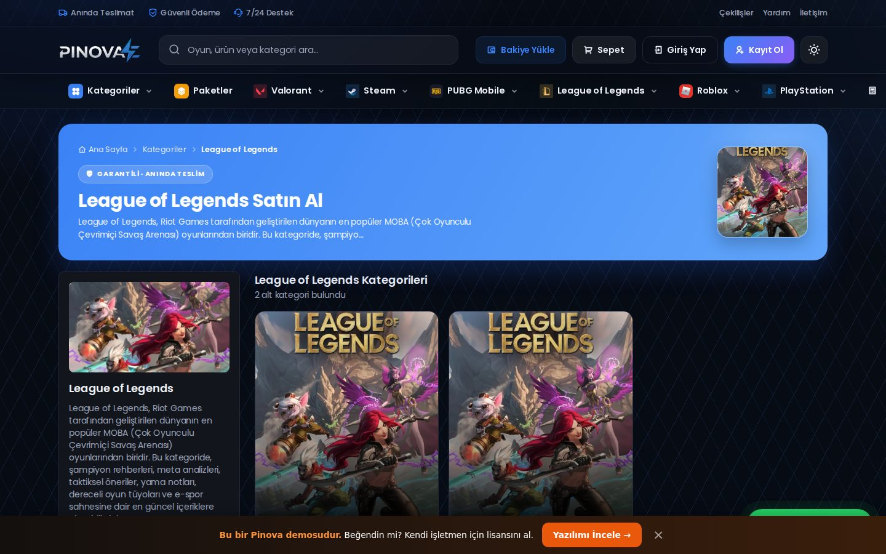 |

| Ürün Detay | Sepet |
|---|---|
| 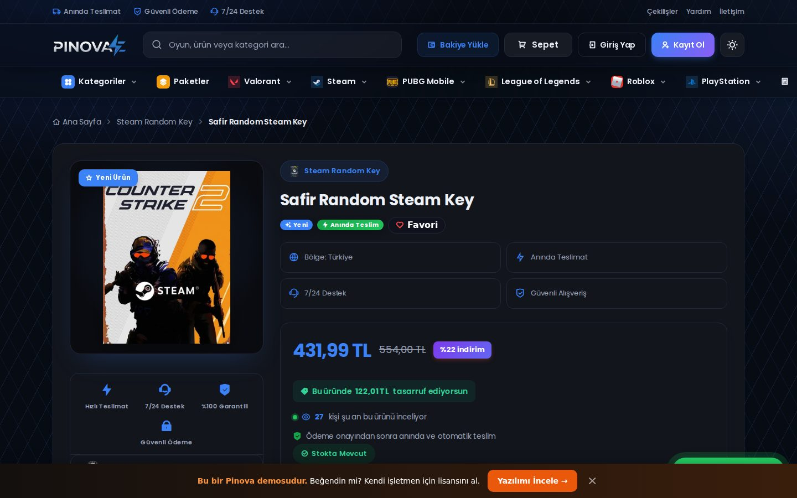 | 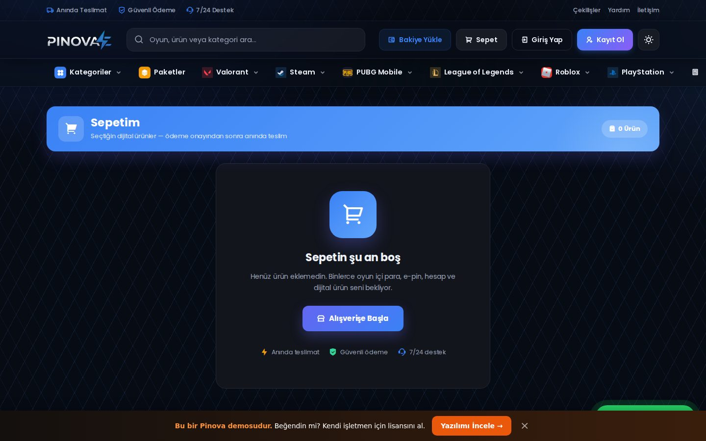 |

| Blog | Çekilişler |
|---|---|
| 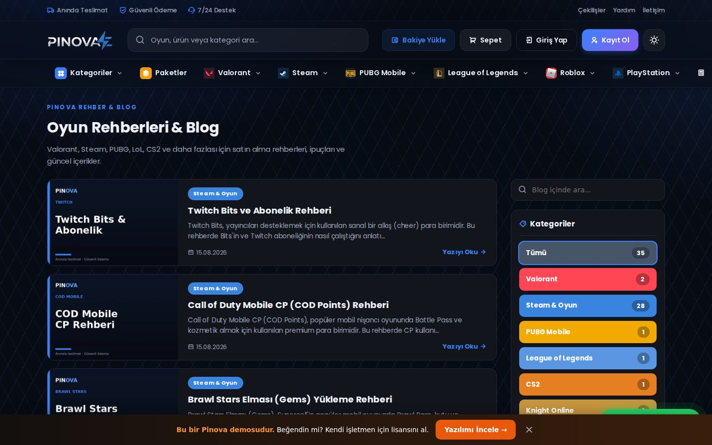 | 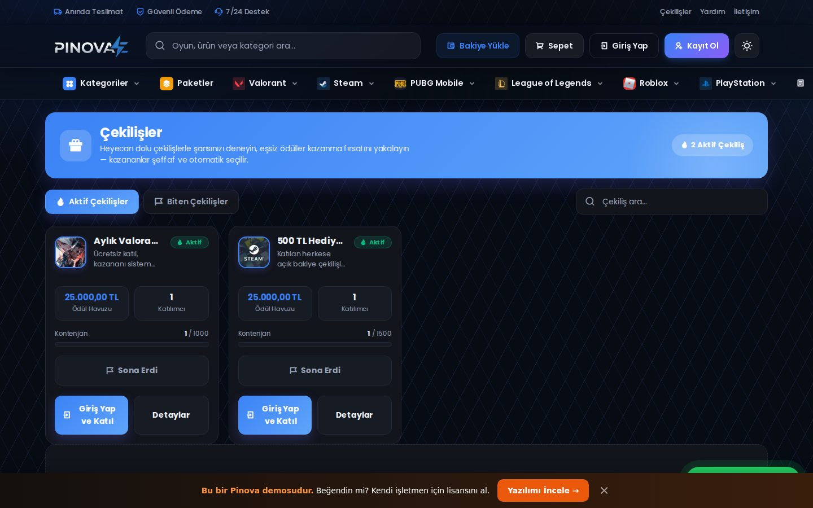 |

| Mobil (responsive) | |
|---|---|
| 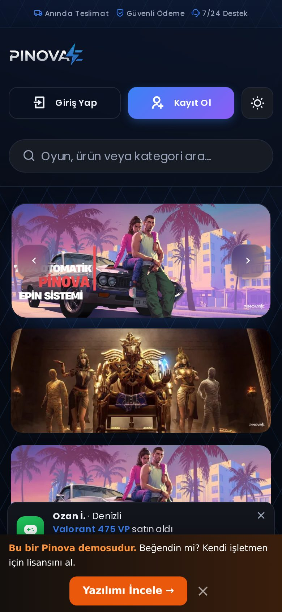 | |

### 🛠️ Yönetim Paneli & Entegrasyonlar

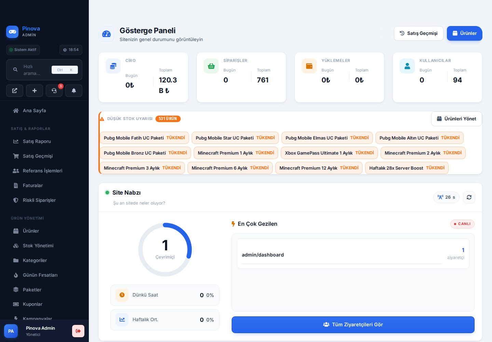

| AI Entegrasyonları (OpenAI/Gemini/Claude) | Ayarlar & Modüller |
|---|---|
| 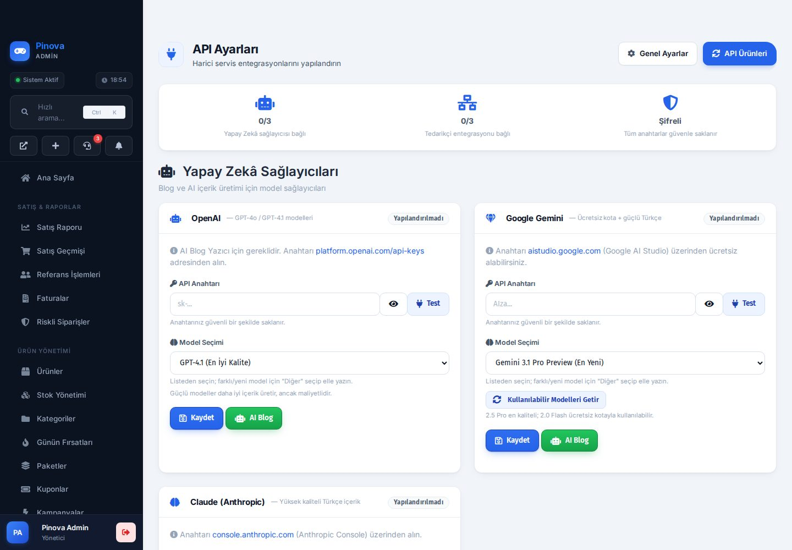 | 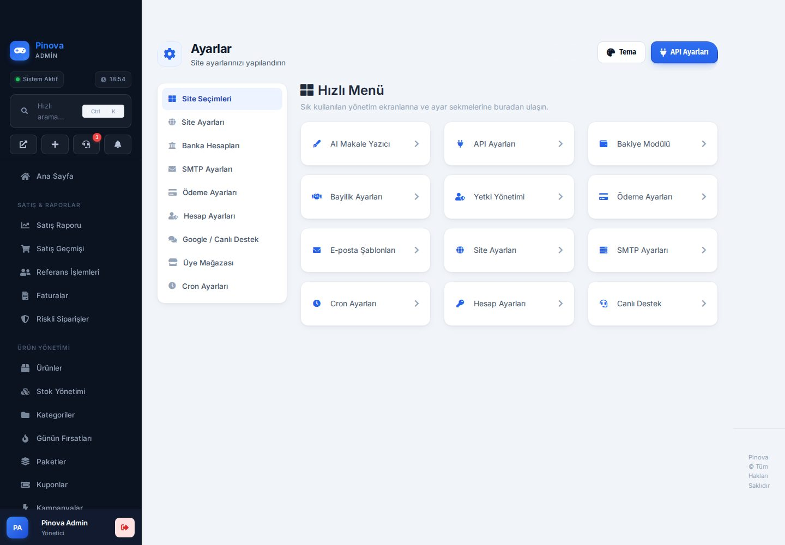 |

| Satış Raporları & Analiz | Ürün Yönetimi |
|---|---|
| 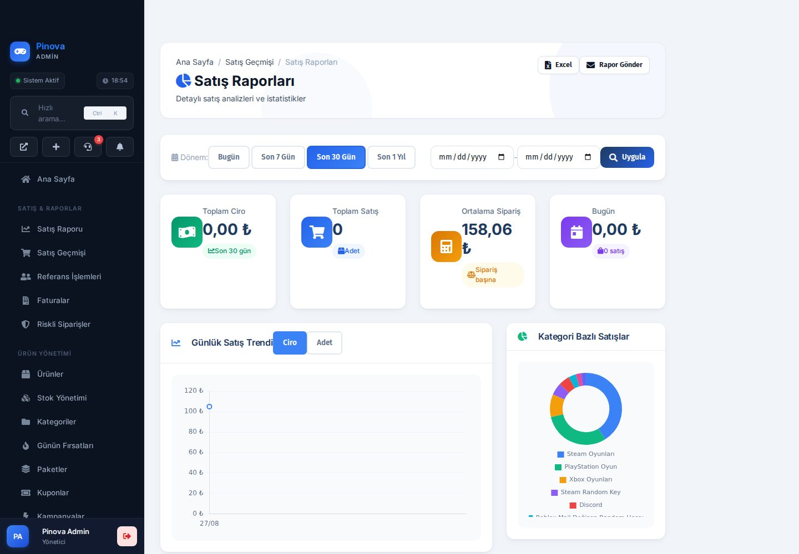 | 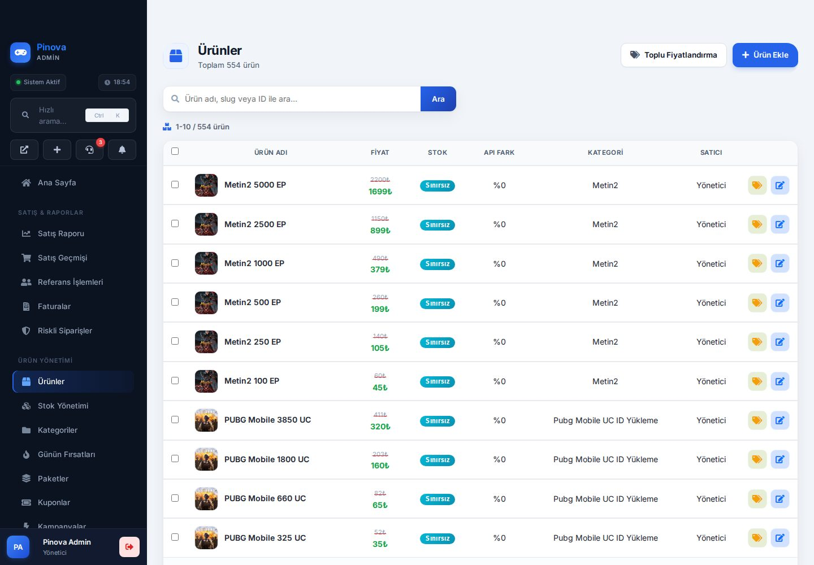 |

> 🔌 **Entegrasyon altyapısı:** epin/stok tedarikçileri için API entegrasyonu, ödeme geçidi modülleri, AI içerik (OpenAI/Gemini/Claude), webhook.

---

## ⭐ Öne Çıkan Özellikler
- ⚡ **Tam otomatik teslimat** — epin/stok kodu ödeme sonrası saniyeler içinde teslim
- 🔐 **AES şifreli stok** — teslim edilecek kodlar veritabanında şifreli saklanır
- 💳 **Bakiye + ödeme** — bakiye yükleme, çoklu ödeme geçidi (kendi POS'unu bağlarsın)
- 🧑‍💼 **Bayilik (reseller) sistemi** — bayi fiyatlandırma ve panel
- 🎁 **Kupon · kampanya · çekiliş** — dönüşüm ve sadakat araçları
- 🤖 **AI blog** — OpenAI / Gemini / Claude ile içerik üretimi
- 📊 **Yönetim paneli** — ürün/stok/sipariş/rapor, ~onlarca sayfa
- 📱 **Mobil uyumlu**, SEO dostu (schema, sitemap, blog)

## 🧩 Teknoloji
PHP (CodeIgniter 3) · MySQL/MariaDB · sunucu‑taraflı render. Ödeme geçitleri modülerdir; alıcı kendi sağlayıcısını bağlar.

## 🔎 Kullanım Alanları
Pinova'yı aşağıdaki işler için hazır bir çözüm olarak geliştirdim:
- **Epin scripti / epin yazılımı** — otomatik epin satış sitesi
- **Dijital ürün satış scripti** — oyun kodu, hediye kartı, lisans, abonelik
- **Oyun parası satış sitesi** — UC, VP, elmas, robux vb.
- **E‑pin bayilik scripti** — bayi paneli ve fiyatlandırma ile

## 💼 Satın Alma / İletişim
Pinova'yı **satıyorum** (epin scripti / epin yazılımı). Canlı demoyu inceleyebilir, satın alma ve lisanslama için benimle iletişime geçebilirsiniz:

- ✉️ **E‑posta:** pazarlama@epinsoft.com.tr
- 📞 **Telefon:** +90 850 255 18 01

## 📄 Lisans
Özel/ticari yazılım — **Tüm hakları saklıdır**. Bkz. [LICENSE.txt](LICENSE.txt).

---

<b>Anahtar kelimeler:</b> epin scripti, epin yazılım, epin yazılımı, epin script, epin satış scripti, epin satış sitesi scripti, otomatik epin satış sistemi, e‑pin scripti, e‑pin yazılımı, dijital ürün satış scripti, oyun kodu satış scripti, oyun parası satış sitesi, steam key satış scripti, epin bayilik scripti, epin bayi paneli, PHP epin / e‑ticaret yazılımı.
